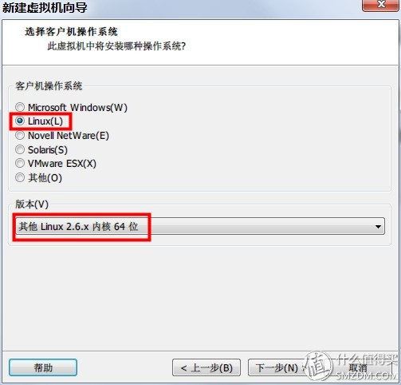
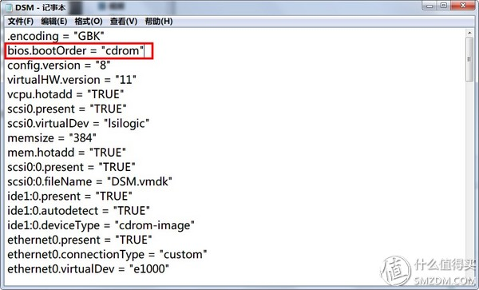
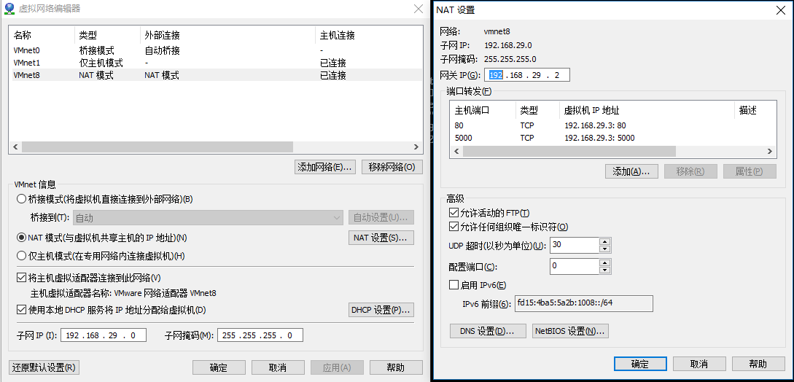

---
title: "vmware中运行群晖系统"
---

# vmware中运行群晖系统

## 创建虚拟机

网上教程是正确的，但有些不必要，如

* 硬盘一定要SATA，其实可以是SCSI的
* 要使用桥接模式，实际NAT就行

其它都没啥问题，只是我有一点没注意：



造成的后果就是虚拟机启动时没有显示Connected字样，当然群晖助手也搜索不到。

## 设置光盘启动

装好系统第一件事是设置光盘启动，因为安装完DSM会自动重启，这时就会进不去了。
可以进bios改，但比较麻烦，最好打开虚拟机文件，第一行.encoding="GBK"下面加一句：

```ini
bios.bootOrder = "cdrom"
```



进入系统后，如果群晖群手能找到服务器，记下IP，用以下两种方法初始化硬盘：

1. 用群晖助手初始化硬盘，可以直接设置固定IP和密码
2. 用网页方式手动安装DSM：<http://192.168.29.130:5000/web_index.html>，这种方法先安装DSM，然后重启后按提示设置密码，进入系统后到"控制面板-网络-网络界面-局域网 1-编辑"进行修改IP。

> 设置密码后，root密码与admin一样

注：如果进入系统后用群晖助手找不到服务器就比较麻烦，不知道IP是多少，可以通过路由器后台找找。我是第一次偶然在启动画面看到IP，尝试后才知道用web可以安装的；如果没看到会因无法登录不能用ifconfig命令查看，不过之后选对了linux内核64位后一直能用群晖助手扫到就没继续研究。

## 配置NAT端口转发（增加一个网卡设为桥接模式更好）

如果使用NAT，手机的ds photo和ds file不能连接NAT，这时可以设置VMWARE的NAT设置，增加端口转发80和5000到虚拟机，并设置系统防火墙允许这两个端口的出入，此时手机端应用就可以直接填写物理机的IP进行连接了（tomcat就不能使用80端口了）。



## Photo Station

Photo Station套件每次都自动在最后一个硬盘根目录找photo文件夹，如果没有会自动创建。
文件如果用samba上传后，则需要进入设置，重建索引。

## 读取群晖硬盘中的文件

可以看[官方链接](
https://www.synology.com/zh-cn/knowledgebase/DSM/tutorial/Storage/How_can_I_recover_data_from_my_DiskStation_using_a_PC)

使用如下命令：

```sh
sudo -i
apt-get install mdadm
apt-get install lvm2
mdadm -Asf && vgchange -ay
```

经测试：

1. 在Ubuntu14中只需安装mdadm，执行命令后被挂载到`/media/ubuntu-kylin/***`
2. 在centos7中只需安装lvm2，执行命令后被挂载到了`/run/media/liveuser/***`

二者都是在liveCD桌面环境中测试成功，在命令行中测试不成功，只因找不到挂载到哪了。

## 关于RAID修复

模拟组raid1成功，目前NAS都使用软raid；
模拟更换硬盘，可以修复raid1；
修复过程中模拟断电，再次启动还能继续。
修复时间比较长。风扇太吵。

## 使用git

1. 安装套件git
2. 创建用户user，群组为users
3. 控制面板-》用户账号-》高级设置-》启用家目录服务。不启用在git clone时会有提示无法转到home目录。
4. 打开套件git，设置user允许访问。
5. 创建文件夹 /volumn1/git/test，进入并执行 git init --bare 创建纯空库，不加参数容易push失败（工作目录锁定错误）。
6. chown root:users -R /volume1/git/test 将文件夹的群组设为users
7. chmod 770 -R /volume1/git/test，使群组用户有读写权限，这样user就可读写了

测试：`git clone ssh://user@192.168.1.3/volume1/git/test`

